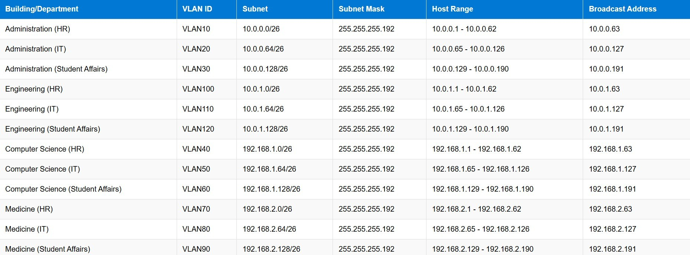

# Helwan National University  
## Computer Networks Project (COM204)  
### Scalable & Secure Campus Network Design

---

## 📘 Course Information

- **Course Code:** COM204  
- **Course Name:** Computer Networks  
- **Instructor:** Prof. Mahmoud Elmesalawy  
- **Teaching Assistant:** Eng. Adham Ehab  
- **Academic Year:** 2024 / 2025  

---

## 👥 Project Team

- **Zeinab Ahmed**
- **Ibrahim Hamdy**    

> Developed collaboratively as part of the COM204 coursework.

---

# 📌 Project Overview

This project presents the design and simulation of a scalable, secure, and structured campus network for **Helwan National University (HNU)** using Cisco Packet Tracer.

The objective is to interconnect four major university buildings while ensuring:

- Logical traffic segmentation  
- Efficient IP addressing using VLSM  
- Dynamic routing implementation  
- Secure remote management  
- Automated IP assignment using DHCP  

---

# 🏢 Network Scope

The implemented network connects the following buildings:

- Administration Building  
- Faculty of Engineering  
- Faculty of Computer Science & Information Technology  
- Faculty of Medicine  

Each building contains multiple departments logically separated using VLAN technology.

---

# 🗺️ Network Topology


## Physical Components

- 4 Routers (One per building)
- 4 Cisco 2960 Switches
- 24 PCs (Department devices)
- VLAN-based segmentation
- Inter-router WAN connections

## Logical Design

- Inter-VLAN Routing
- Dynamic routing between routers
- Centralized DHCP configuration
- Secure remote device management

---

# 🧠 Network Design Architecture

<details>
<summary><strong>Click to Expand – Core Design Principles</strong></summary>

## 1️⃣ Hierarchical Structure
- Access Layer → Switches
- Core Layer → Routers
- Structured building-to-building connectivity

## 2️⃣ Scalability
- VLSM allows future expansion
- Modular building-based segmentation

## 3️⃣ Security
- VLAN isolation
- Telnet & SSH configuration
- Console and VTY authentication

## 4️⃣ Manageability
- Hostname configuration
- Management IP addressing
- Routing table verification

</details>

---

# 🌐 VLAN Implementation

| Department      | VLAN ID | Purpose                  |
| --------------- | ------- | ------------------------ |
| Human Resources | 10      | Administrative isolation |
| IT Department   | 20      | Technical infrastructure |
| Student Affairs | 30      | Student service systems  |

### VLAN Strategy

- Dedicated VLAN per department
- Access ports assigned accordingly
- Trunk links between switches and routers
- Inter-VLAN routing enabled via router interfaces

---

# 🧮 Subnetting Plan (VLSM)



VLSM (Variable Length Subnet Masking) was implemented to:

- Reduce IP address waste  
- Provide flexible growth  
- Allocate IP blocks based on department size  

## Example Allocation

| Building / Department  | Subnet        | Subnet Mask     | Usable Hosts | Broadcast  |
| ---------------------- | ------------- | --------------- | ------------ | ---------- |
| Admin – HR             | 10.0.0.0/26   | 255.255.255.192 | 62           | 10.0.0.63  |
| Engineering – IT       | 10.0.0.64/26  | 255.255.255.192 | 62           | 10.0.0.127 |
| CSIT – Student Affairs | 10.0.0.128/26 | 255.255.255.192 | 62           | 10.0.0.191 |

> Note: Actual addressing may slightly vary in the Packet Tracer file.

---

# 🔄 Routing Configuration

The routing strategy includes:

- RIP (Routing Information Protocol)
- OSPF (Open Shortest Path First)
- Static routes where necessary

## Verification Commands

```
show ip route
show ip protocols
````

Routing ensures seamless communication between all buildings and VLANs.

---

# 📡 DHCP Configuration

* Automatic IP address distribution
* Eliminates IP conflicts
* Simplifies device deployment
* Separate DHCP pools per VLAN

---

# 🔐 Remote Access & Security

* Telnet configured for remote CLI access
* SSH enabled for encrypted remote management
* Line console and VTY password protection
* Hostname identification for easier troubleshooting

---

# ⚙️ Sample Router Configuration

```
enable
configure terminal
hostname HNU-CS

interface gigabitEthernet 0/0
ip address 192.168.1.62 255.255.255.192
no shutdown

router rip
version 2
network 10.0.0.0
no auto-summary
```

---

# 🧪 Network Testing & Validation


The following tests were performed:

* Inter-building Ping
* Inter-VLAN communication
* DHCP address assignment verification
* Telnet & SSH remote access testing
* Routing table validation

<details>
<summary><strong>Click to Expand – Testing Procedure</strong></summary>

1. Use `ping` between PCs in different VLANs
2. Use `ping` between routers
3. Verify DHCP using `ipconfig`
4. Access routers via Telnet or SSH
5. Check routing table using `show ip route`

</details>

---

# 🚧 Challenges & Resolutions

| Issue                   | Resolution                               |
| ----------------------- | ---------------------------------------- |
| VLAN misconfiguration   | Rechecked port assignments & trunk links |
| Routing inconsistencies | Verified network statements in RIP/OSPF  |
| IP conflicts            | Adjusted subnetting & enabled DHCP       |
| Remote access failure   | Reviewed VTY configuration               |

---

# 📂 Project Structure

```
Project Root
│
├── images/
│   ├── Network.jpg
│   ├── Subnetting_Plan.jpg
│   └── Testing.jpg
│
├── Project.pkt
├── Documentation.pdf
└── README.md
```

---

# 🖥️ Requirements

* Cisco Packet Tracer
* Understanding of:

  * Subnetting & VLSM
  * VLAN Configuration
  * Routing Protocols (RIP / OSPF)
  * DHCP
  * Basic Network Security

---

# 📈 Future Improvements

* Implement Access Control Lists (ACLs)
* Introduce centralized servers
* Deploy multi-area OSPF
* Add firewall segmentation
* Integrate monitoring tools

---

# ✅ Conclusion

This project successfully demonstrates the design and deployment of a structured university campus network that achieves:

* Efficient IP allocation
* Logical traffic segmentation
* Reliable inter-building routing
* Secure remote management
* Expandable architecture

The network is scalable and ready for future expansion across the university campus.

---

## 📜 Academic Note

This project is submitted as coursework for COM204 – Computer Networks.

---

### Designed and Implemented By

**Zeinab Ahmed & Ibrahim Hamdy**
